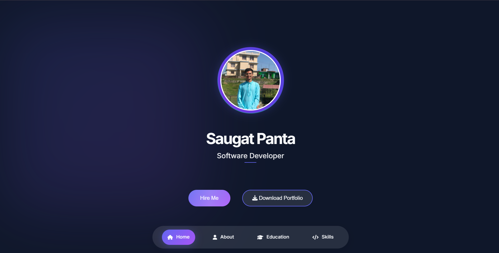
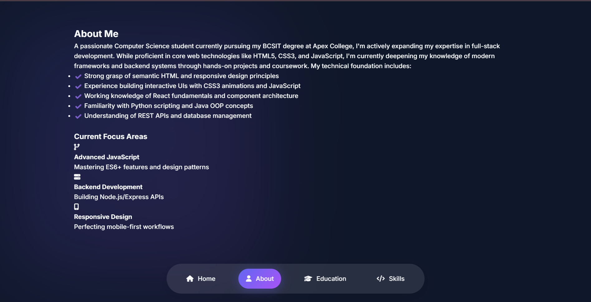
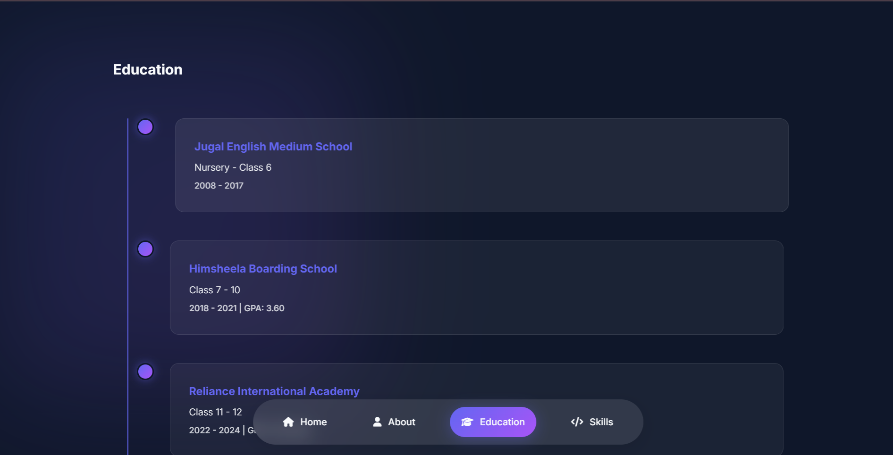
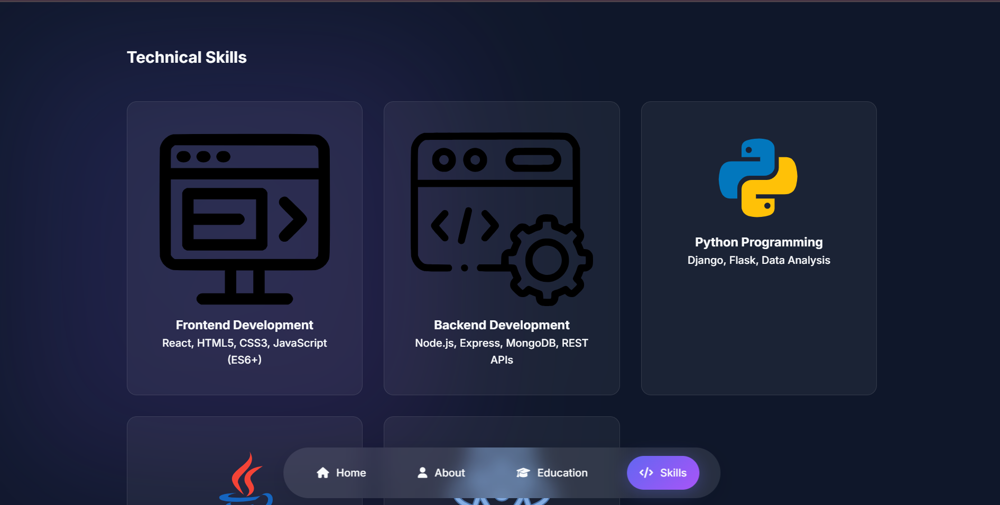

# Saugat Panta - Portfolio Website

[](https://opensource.org/licenses/MIT)
[](https://yourusername.github.io/portfolio)







## 🌟 Features

- **Modern Responsive Design**: Fully responsive across all devices
- **Interactive UI Elements**:
  - Animated navigation bar
  - Smooth scroll transitions
  - Hover effects and animations
- **Dynamic Content**:
  - Education timeline
  - Skills matrix
  - Project achievements
- **Contact System**:
  - Google Sheets integration
  - Email notifications
  - Rate limiting
- **PDF Generator**: One-click portfolio download
- **Performance Optimized**:
  - Lazy loading
  - Image optimization
  - Minimal dependencies

## 🛠 Technologies Used

- **Frontend**: HTML5, CSS3, JavaScript (ES6+)
- **PDF Generation**: [jsPDF](https://parall.ax/products/jspdf)
- **Form Handling**: Google Apps Script, Formspree
- **Icons**: Font Awesome
- **Animations**: Custom CSS animations

## 🚀 Installation

1. Clone the repository:
```bash
git clone https://github.com/yourusername/portfolio.git
cd portfolio

